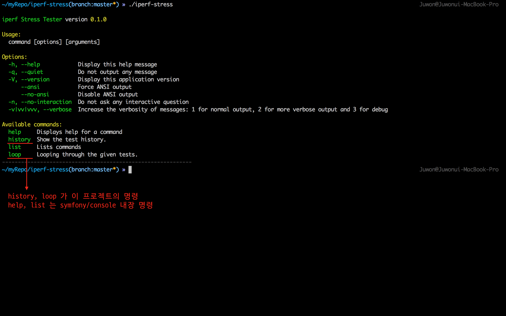
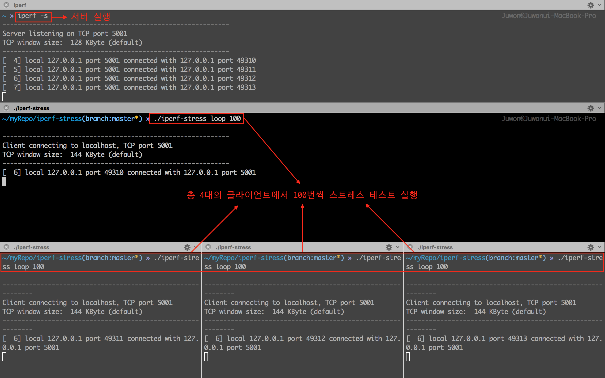
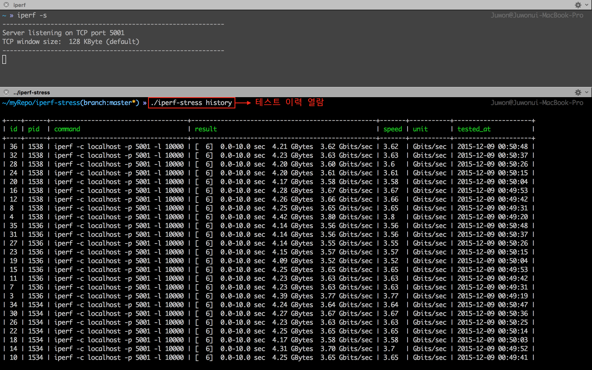
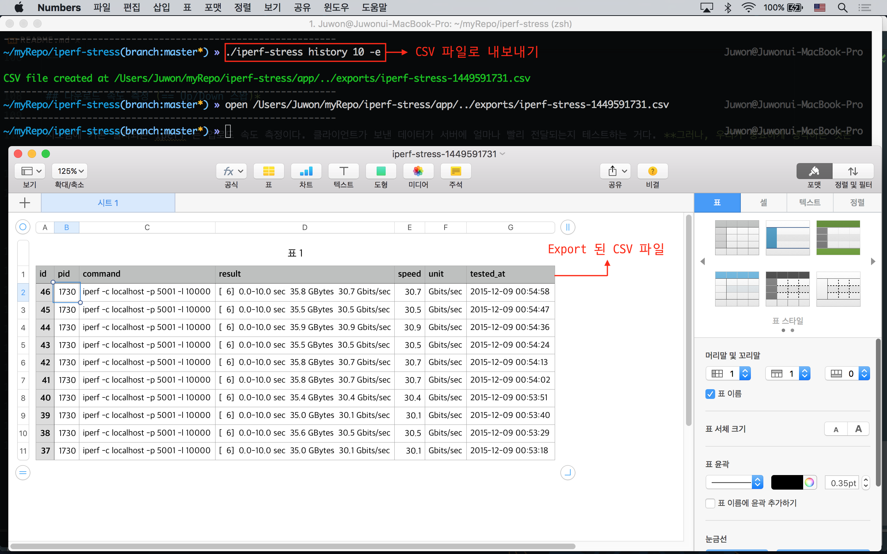
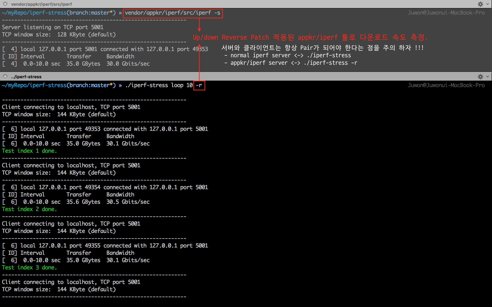

# iperf-stress

이 프로젝트는 아래와 같은 3가지의 학습 목적으로 공개되었다.

1. `symfony/console` 콤포넌트를 이용한 콘솔 코맨드 개발 학습
2. Non-Laravel 프로젝트에서 `illuminate/database (== Eolquent)` 콤포넌트의 사용법 학습
3. Non-Laravel 프로젝트에서 `illumicate/validation` 콤포넌트의 사용법 학습

## 목차
- 개요
- 설치
- 실행
- 다운로드 속도 측정
- phar build

## 개요

`iperf` 는 인터넷 속도 측정을 위한 CLI 이다. 이 프로젝트의 `iperf-stress` 는 `iperf` 를 Wrapping 한 CLI 이다. `iperf-stress` 는 스트레스 상황에서, `iperf` 속도 측정 서버의 측정 결과 안정성, 서버 용량 예측, 동접 예측 등의 목적으로 개발되었다. Linux PC/Mac에서 여러 개의 콘솔 창을 띄워 놓고, 이 코맨드를 이용하여 스트레스 상황을 연출할 수 있다.

## 설치

아래 요구사항을 확인하고, 프로젝트를 설치해 보자.

- Linux 또는 Mac OS
- iperf (`$ iperf -v` 로 확인 가능)
- php5.4 이상 (`$ php -v` 로 확인 가능)

### 설치 방법

Linux/Mac 시스템에 `iperf` 툴이 없다면, 아래 명령으로 설치하자.

```bash
# Linux
$ sudo apt-get install iperf
# Mac OS
$ brew install iperf
```

Git 프로젝트를 클론하고 `iperf-stress` 파일에 실행권한을 부여한다. 컴포저 컴포넌트들을 업데이트한다. 결과값을 저장하기 위한 DB 도 만든다.

**`참고`** 이 프로젝트는 컴퓨터에 설치한/된 `iperf` 외에, 별도로 빌드된 커스텀 [`appkr/iperf`](https://github.com/appkr/iperf) 를 vendor 디렉토리 아래에 설치한다. 컴포저 실행 중에 다운로드 받은 `appkr/iperf` 를 컴파일할 것인데, 의심스러우면 컴포저를 실행하기 전에 composer.json 에서 `scripts` 섹션을 지우고 나중에 수동으로 컴파일 하시기 바란다. 

```bash
$ git clone git@github.com:appkr/iperf-stress.git
$ cd iperf-stress
$ composer install
$ chmod 755 bin/iperf-stress
```

## 실행

### 서버 구동

먼저 클라이언트에서 보낸 속도 측정 요청을 받아 줄 서버를 구동시킨다. 이 프로젝트와는 관련 없는 일반적인 `iperf` 명령 사용법이다.

```bash
$ iperf -s
```

### 명령 프로토타입 (signature)

`iperf-stress` 명령은 아래와 같은 Signature 를 가진다.

```bash
$ bin/iperf-stress 명령 [명령인자] [옵션1=값1 옵션2=값2 ...]
```



### `loop` 명령

반복할 횟수를 명령 인자로 받는다 (기본값은 '1' 회). 명령 인자로 받은 만큼 속도측정을 수행하고 결과를 DB 에 기록한다. 가령, 5 번을 테스트하려면,

```bash
$ bin/iperf-stress loop 5
```

#### 옵션

옵션은 `$ bin/iperf-stress help loop` 로 확인할 수 있다.

옵션|설명
---|---
`--sleep (-s)`|테스트 loop 사이의 sleep 을 지정한다. **(default: 1)**
`--reverse (-r)`|Up/Down 스왑을 적용한다.
`--client (-c)`|클라이언트 모드로 동작하며, 옵션 값으로 지정한 서버로 접속한다. **(default: "localhost")**
`--port (-p)`|접속할 서버의 포트 번호를 지정한다. **(default: 5001)**
`--len (-l)`|한번에 읽고 쓸 버퍼량을 지정한다. udp 에는 적용되지 않는다. **(default: 10000)**
`--udp (-u)`|TCP 대신 UDP 를 사용한다.



### `history` 명령

출력/덤프할 레코드 갯수를 명령인자로 받는다 (기본값은 '전체'). 명령인자로 받은 수 만큼 DB 에 기록된 속도측정 이력을 테이블로 출력하거나, csv 형태로 Export 한다. 

#### 옵션 

옵션은 `$ bin/iperf-stress help history` 로 확인할 수 있다.

옵션|설명
---|---
`--extract (-e)`|`exports/` 디렉토리에 DB 테이블을 CSV 파일로 덤프한다.
`--truncate (-t)`|테스트 이력을 모두 삭제한다.





---

## 다운로드 속도 측정 (== Up/Down 스왑)*

시스템에 기본 설치되는 iperf 는 업로드 속도 측정이다. 클라이언트가 보낸 데이터가 서버에 얼마나 빨리 전달되는지 테스트하는 거다. **그러나, 우리가 중요하게 생각하는 것은 다운로드 속도!!!** 다운로드 속도 측정을 위해서는 Up/Down 스왑 패치를 적용한 `vendor/appkr/iperf/src/iperf` 툴을 이용한다. 

1) 클라이언트 <-> 2) 랜케이블/Wi-Fi 액세스포인트/Lte 기지국 등의 액세스 네트워크 <-> 3) 인터넷 <-> 4) 원격서버 간의 통신 구조에서 2), 3) 의 속도를 의미한다. 클라이언트의 위치나 시간에 따라, 각 노드의 혼잡도에 따라 다른 Route 를 탈 수 있으며, 속도는 달라지게 된다. 여튼 중요한 것은 **속도 측정을 위한 서버에도 클라이언트와 동일한 iperf 툴이 설치되어야 한다** 는 것이다. 



**`참고`** 다운로드 속도 측정은 위한 커스텀 `appkr/iperf` 툴은 컴포저 설치과정에서 컴파일되는데, 어떤 이유에서든 에러가 났다면 아래를 참고해서 다시 컴파일 할 수 있다.

```bash
$ cd iperf-stress/vendor/appkr/iperf
$ make clean
$ ./configure
$ make
```